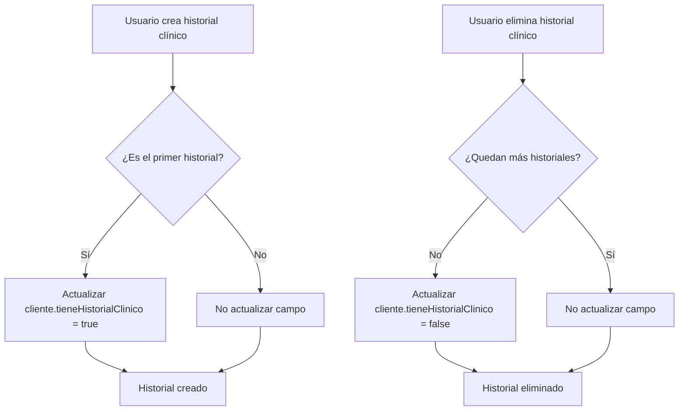

# Campo `tieneHistorialClinico` en Clientes

## 📋 Descripción General

Se ha añadido un nuevo campo booleano `tieneHistorialClinico` al modelo `Cliente` que indica si un cliente tiene al menos un historial clínico registrado en su subcolección `historialClinico`.

## 🎯 Objetivo

**Problema resuelto:** Antes, para saber si un cliente tenía historiales clínicos era necesario consultar la subcolección `clientes/{clienteId}/historialClinico` de cada cliente, lo que implicaba lecturas adicionales a Firestore.

**Solución:** Ahora el campo `tieneHistorialClinico` se actualiza automáticamente cuando:
- Se crea el **primer** historial clínico → se actualiza a `true`
- Se elimina el **último** historial clínico → se actualiza a `false`

## 🔧 Cambios Implementados

### 1. Modelo Cliente (`cliente.model.ts`)

```typescript
export interface Cliente {
  // ... otros campos
  
  /** Indica si el cliente tiene al menos un historial clínico registrado */
  tieneHistorialClinico?: boolean;
  
  // ...
}
```

### 2. Servicio HistorialClinicoService

#### Método `crearHistorial()`
```typescript
async crearHistorial(clienteId: string, data: ...): Promise<string> {
  // Verificar si es el primer historial
  const totalHistoriales = await this.contarHistoriales(clienteId);
  const esPrimerHistorial = totalHistoriales === 0;

  // Crear el historial
  const docRef = await addDoc(colRef, { ... });

  // Si es el primer historial, actualizar el flag en el cliente
  if (esPrimerHistorial) {
    await this.actualizarFlagHistorialEnCliente(clienteId, true);
  }

  return docRef.id;
}
```

#### Método `eliminarHistorial()`
```typescript
async eliminarHistorial(clienteId: string, historialId: string): Promise<void> {
  // Eliminar el historial
  await deleteDoc(ref);

  // Verificar si quedan historiales después de eliminar
  const totalHistoriales = await this.contarHistoriales(clienteId);
  
  // Si no quedan historiales, actualizar el flag a false
  if (totalHistoriales === 0) {
    await this.actualizarFlagHistorialEnCliente(clienteId, false);
  }
}
```

#### Método privado auxiliar
```typescript
private async actualizarFlagHistorialEnCliente(
  clienteId: string, 
  tieneHistorial: boolean
): Promise<void> {
  const clienteRef = doc(this.fs, `clientes/${clienteId}`);
  await updateDoc(clienteRef, {
    tieneHistorialClinico: tieneHistorial,
    updatedAt: serverTimestamp()
  });
}
```

## 📊 Script de Migración

Para actualizar todos los clientes existentes, ejecutar:

```bash
node GUIAS/actualizar-flag-historial-clinico.js
```

El script:
1. ✅ Lee todos los clientes de Firestore
2. ✅ Cuenta los historiales en cada subcolección `historialClinico`
3. ✅ Actualiza el campo `tieneHistorialClinico` (true/false)
4. ✅ Muestra resumen con estadísticas

**Salida esperada:**
```
🚀 Iniciando actualización de campo tieneHistorialClinico...

📊 Total de clientes encontrados: 78

✅ 1/78 - Cliente: GINGER ROMERO MORENO (0704472448) - 1 historial(es) → TRUE
⚪ 2/78 - Cliente: JACK CEDEÑO MENDOZA (3245687) - Sin historiales → FALSE
✅ 3/78 - Cliente: SAIDA CULCAY VELEZ (0703974030) - 2 historial(es) → TRUE
...

════════════════════════════════════════════════════════
📋 RESUMEN DE MIGRACIÓN
════════════════════════════════════════════════════════
Total de clientes procesados: 78
  ✅ Con historial clínico:    45
  ⚪ Sin historial clínico:    33
  ❌ Errores:                  0
════════════════════════════════════════════════════════
```

## 💡 Uso en la Aplicación

### Ejemplo: Mostrar badge en lista de clientes

```typescript
// En el template HTML
<span class="badge" 
      [class.badge-success]="cliente.tieneHistorialClinico"
      [class.badge-secondary]="!cliente.tieneHistorialClinico">
  {{ cliente.tieneHistorialClinico ? 'CON HISTORIAL' : 'SIN HISTORIAL' }}
</span>
```

### Ejemplo: Filtrar clientes con/sin historiales

```typescript
// En el componente
clientesConHistorial$ = this.clientesService.getClientes().pipe(
  map(clientes => clientes.filter(c => c.tieneHistorialClinico))
);

clientesSinHistorial$ = this.clientesService.getClientes().pipe(
  map(clientes => clientes.filter(c => !c.tieneHistorialClinico))
);
```

### Ejemplo: Condición en botón "Ver Historiales"

```html
<button 
  [disabled]="!cliente.tieneHistorialClinico"
  (click)="verHistoriales(cliente)">
  <svg>...</svg>
  {{ cliente.tieneHistorialClinico ? 'Ver Historiales' : 'Sin Historiales' }}
</button>
```

## ⚠️ Consideraciones Importantes

### Consistencia de Datos
El campo se actualiza automáticamente solo cuando se usan los métodos del servicio:
- ✅ `crearHistorial()` - Actualiza a `true` si es el primero
- ✅ `eliminarHistorial()` - Actualiza a `false` si era el último

❌ **EVITAR**: Modificar manualmente la subcolección `historialClinico` sin usar el servicio, ya que el flag no se actualizará.

### Impacto en Rendimiento
- ✅ **Mejora lecturas**: Ya no es necesario consultar la subcolección para saber si tiene historiales
- ⚠️ **Costo adicional**: Cada creación/eliminación actualiza el documento del cliente (+1 escritura)

### Backward Compatibility
- Clientes sin el campo `tieneHistorialClinico` → TypeScript lo trata como `undefined`
- Recomendado: Ejecutar el script de migración para tener datos consistentes

## 🔄 Flujo de Actualización



## 📝 Notas de Migración

- Fecha de implementación: 8 de febrero de 2026
- Versión: Angular 20
- Firebase: @angular/fire 18.x
- Script ejecutado: `GUIAS/actualizar-flag-historial-clinico.js`

## ✅ Checklist de Implementación

- [x] Actualizar modelo `Cliente` con campo `tieneHistorialClinico`
- [x] Modificar `crearHistorial()` para actualizar flag en primer historial
- [x] Modificar `eliminarHistorial()` para actualizar flag si era el último
- [x] Crear método privado `actualizarFlagHistorialEnCliente()`
- [x] Crear script de migración `actualizar-flag-historial-clinico.js`
- [x] Documentar cambios en `IMPLEMENTACION-FLAG-HISTORIAL.md`
- [ ] Ejecutar script de migración en producción
- [ ] Actualizar UI de lista de clientes para mostrar badge
- [ ] Añadir filtros por estado de historial en módulo de clientes

---

**Documentación actualizada:** 8 de febrero de 2026
